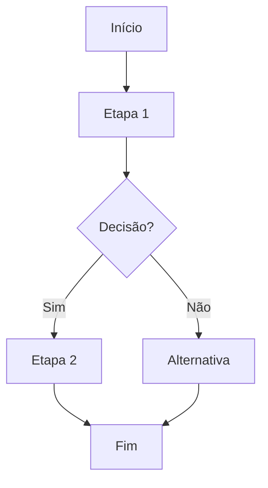

# Documento de Processo — [NOME DO PROCESSO]
 
## Metadados do Documento
- **Processo:** [N0 — N1 — N2]
- **Área dona:** [Nome da área/responsável]
- **Elaborado por:** [Nome/time]
- **Revisado por:** [Nome/time]
- **Versão:** [v1.0]
- **Data:** [YYYY-MM-DD]
- **Status:** [Rascunho | Em revisão | Aprovado]
- **Classificação:** [Público | Interno | Restrito | Confidencial]
- **Escopo:** As Is
- **Fontes consultadas:** [Fontes utilizadas]
 
---
 
## 1. Descrição Geral do Processo
 
### 1.1 Nome do Processo
[Nome completo do processo]
 
### 1.2 Objetivo Principal
- **Finalidade de negócio:** [Por que esse processo existe]
- **Resultado esperado:** [Qual valor entrega]
- **Critérios de sucesso:** [Como "bom" é medido]
 
### 1.3 Escopo Consolidado
- **Início:** [O que dispara o processo]
- **Fim:** [O que caracteriza o encerramento]
 
**Entradas do Processo:**
[Lista em formato de parágrafo, separada por vírgulas ou ponto-e-vírgula — NÃO usar bullets]

**Saídas do Processo:**
[Lista em formato de parágrafo, separada por vírgulas ou ponto-e-vírgula — NÃO usar bullets]

- **Dentro do escopo:** [O que o processo cobre]
- **Fora do escopo:** [O que NÃO está coberto]
 
---
 
## 2. Fluxograma Simplificado do Processo
 

 
---
 
## 3. Fluxo Consolidado e Atores
 
### 3.1 Tabela do fluxo
 
| Etapa | Principais Atividades | Atores | Sistemas |
|------:|------------------------|--------|----------|
 
### 3.2 Observações
- **Regras/Políticas:** [Normas, regulações]
- **Exceções:** [Variações do fluxo]
- **Dependências:** [Áreas, integrações]
- **Controles/Aprovações:** [Quem aprova, quando]
- **Riscos:** [Riscos identificados]
 
---
 
## 4. Diagnóstico do Processo AS-IS
 
### 4.1 Principais pontos críticos

1) **Problema 1 — [Título]**
   - Sintoma: [Descrição]
   - Etapa: [Referência]
   - Evidências: [Dados]
   - Frequência: [Sempre | Recorrente | Pontual]
   - Severidade: [Alta | Média | Baixa]
 
### 4.2 Causas prováveis
- [Causa 1: tecnologia/integração]
- [Causa 2: processo/regra]
- [Causa 3: pessoas/capacitação]

### 4.3 Impactos
- **Tempo:** [Descrição]
- **Custo:** [Descrição]
- **Qualidade:** [Descrição]
- **Risco:** [Descrição]
- **Experiência do cliente:** [Descrição]
 
---
 
## 5. Melhorias Possíveis
 
### 5.1 Lista de melhorias
 
| # | Etapa | Problema | Melhoria | Tipo | Ganho | Esforço | Dependências | Notas |
|---:|-------|----------|----------|------|-------|---------|--------------|-------|
 
### 5.2 Priorização
- **Critério:** Impacto x Esforço x Urgência
- **Top 3 melhorias:**
  1. Melhoria #X — [nome]
  2. Melhoria #Y — [nome]
  3. Melhoria #Z — [nome]
 
---
 
## 6. KPIs e Informações Adicionais
 
### 6.1 Principais KPIs

- **KPI 1 — [Nome]:**
  - Definição: [O que mede]
  - Fórmula: [Cálculo]
  - Fonte: [Sistema]
  - Frequência: [Diária | Semanal | Mensal]
  - Meta: [Valor]
  - Dono: [Área/papel]
  - Observações: [Limitações]
 
### 6.2 Informações operacionais
- **Volumetria:** [Dados]
- **Sazonalidade:** [Picos]
- **Capacidade/Headcount:** [Equipes]
- **SLAs internos:** [Prazos]
- **Integrações:** [APIs, RPAs, jobs]
- **Qualidade de dados:** [Inconsistências]
 
### 6.3 Atividades Manuais
- **Atividade 1:** [Descrição]
  - Motivo: [Razão]
  - Impacto: [Tempo, erro, custo]
  - Volume: [Frequência]
 
---
 
## Anexos
 
### Anexo A — Glossário
- **Termo 1:** Definição
 
### Anexo B — Referências
- Link 1
 
### Anexo C — Evidências
- Evidência 1
 
---
 
## Checklist de Qualidade
 
- [ ] Processo tem início e fim claros
- [ ] Entradas e saídas coerentes
- [ ] Fluxograma condiz com tabela
- [ ] Etapas têm atores e sistemas
- [ ] Diagnóstico tem evidências
- [ ] Melhorias referenciam etapas/problemas
- [ ] KPIs têm definição+fonte+frequência
- [ ] Manualidades descritas com impacto
- [ ] Classificação preenchida
- [ ] Metadados completos
